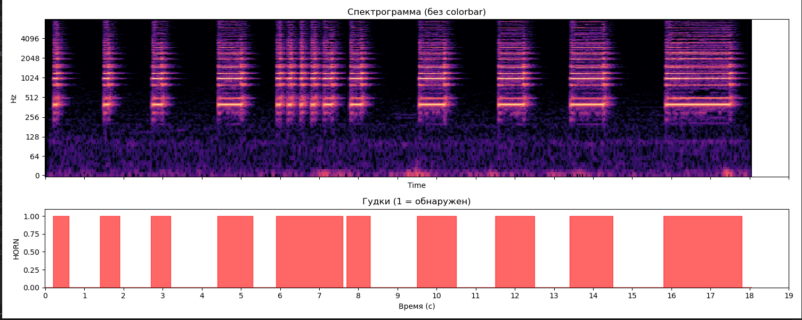
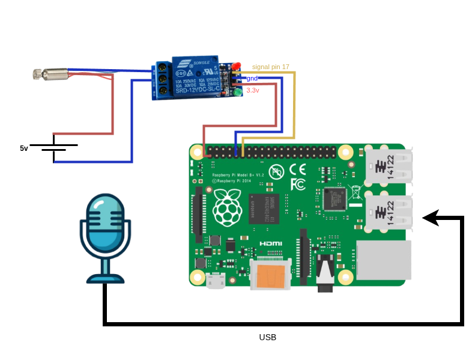

```
├── data
│    └── raw
│        ├── clean_horn
│        │   ├── neg # паузы шумы и тп итд
│        │   └── pos #только звук детекта
│        ├── horn # нечищенные позитивы сигналы с паузами
│        │   ├── 08551.mp3
│        └── noise #шумы
│            └── whistling-sound.mp3
└── horn_ml
    ├── runtime
    │  ├── realtime_file.py # анализ с тестового файла вывод спектрограммы
    │  └── realtime_mic.py #
    └── training
        ├── augment.py # аугментация
        ├── models 
        │  ├── horn_rf_goof.pkl
        │  └── horn_rf.pkl
        └── train_rf.py #
```

# 🚗 Horn Detector

Детекция автомобильного гудка в реальном времени

## 1️⃣ Готовим данные
- Размечаем аудио в **Audacity** (вырезаем чистые гудки).
- Складываем:
  - `data/raw/clean_horn/pos` → только гудки  
  - `data/raw/clean_horn/neg` → только фон / шум  

---

## 2️⃣ Обучаем модель

```bash
python train_rf.py
````

Что происходит:

* режем аудио на окна
* делаем аугментацию (шум, громкость, скорость, pitch, микрофоны)
* извлекаем признаки (MFCC + спектральные)
* обучаем **RandomForest**
* сохраняем `models/horn_rf.pkl`

---

## 3️⃣ Режимы работы

### ▶ Проверка на файле (симуляция микрофона)

```bash
python realtime_file.py
```

---

### 🎤 Микрофон

```bash
python realtime_mic.py
```

В консоли:

```
RMS: 0.0123
>>> HORN DETECTED <<<
```


---
